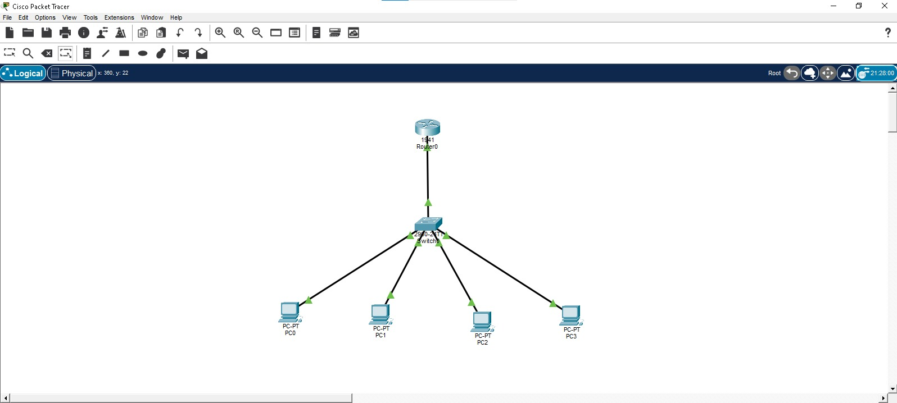
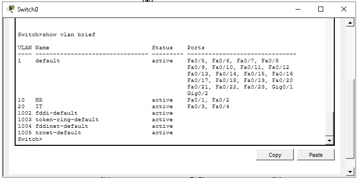
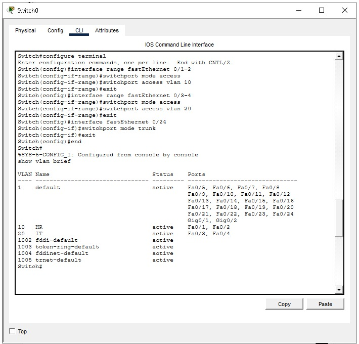
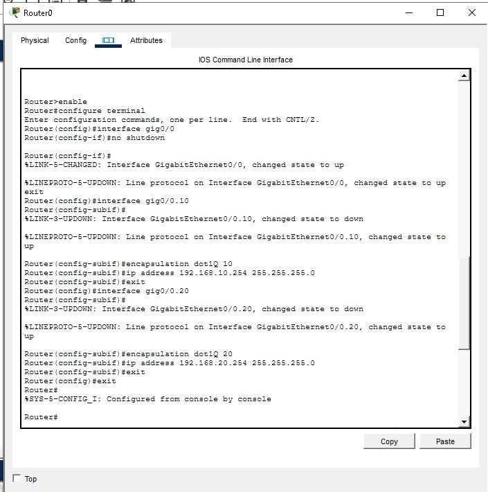
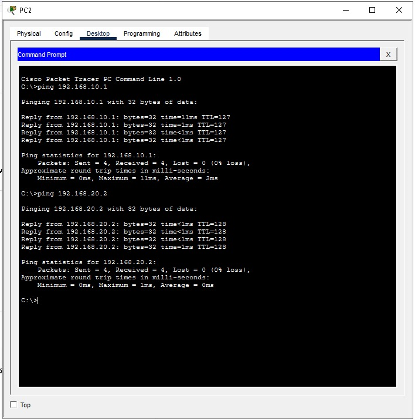

# INTER-VLAN ROUTING PROJECT - Cisco Packet Tracer

## OBJECTIVE

Designed inter-VLAN routing using Router-on-a-Stick to enable communication between devices in different VLANs.

## NETWORK DESIGN

* 1 Router
* 1 Switch
* 4 PCs
* VLAN 10 for HR
* VLAN 20 for IT

## CONFIGURATION TASKS

* Created VLAN 10 and VLAN 20 on the switch
* Assigned switch ports to the correct VLANs
* Configured trunking between switch and router
* Created router subinterfaces for each VLAN
* Assigned IP addresses and default gateways to PCs
* Verified communication between VLANs

## RESULTS

* Devices within the same VLAN communicated successfully
* Devices in different VLANs communicated through the router
* Inter-VLAN routing was successfully implemented

## TECHNOLOGIES USED

* Cisco Packet Tracer
* VLANs
* 802.1Q Trunking
* Router Subinterfaces
* IP Addressing
* Routing

## SKILLS DEMONSTRATED

* VLAN configuration
* Trunk port configuration
* Inter-VLAN routing
* Router subinterface configuration
* Network troubleshooting

## SCREENSHOTS

### Network Topology

### VLAN Configuration

### Trunk Port Configuration

### Router Interfaces

### Ping Test

## Project File

* router-on-stick.pkt

## Author

Kgothatso Seshoka
